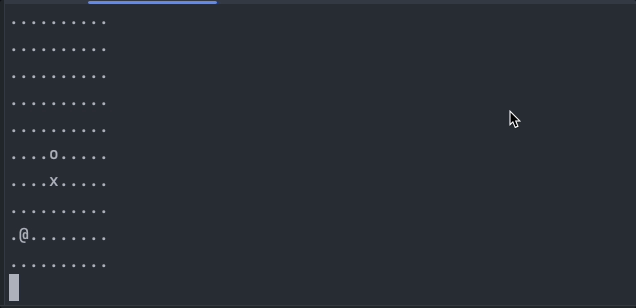

# Notes on implementation

- Snake moves up, down, left, right.
- You can not move snake to opposite direction immediately (if snake goes up `down` is not valid command, so it will be
  skipped, technically snake will continue moving up).
- `@` = food, `o` = snake head, `x` = snake body
- Game over when snake collides with itself.
- Snake grows when it "eats" food pellet.

# TODO
- Better test coverage
- Pick randomly init food pellet 

# Running

## To simulate snake eating first food pellet run

```shell
sbt "runMain io.mikla.snake.Simulate"
```

## Play game in console

```shell
sbt "runMain io.mikla.snake.Play"
```

Use `U`, `D`, `L`, `R` (also its lowercase variants) to control snake, or just any other input to continue snake moving
forward

# Demo

